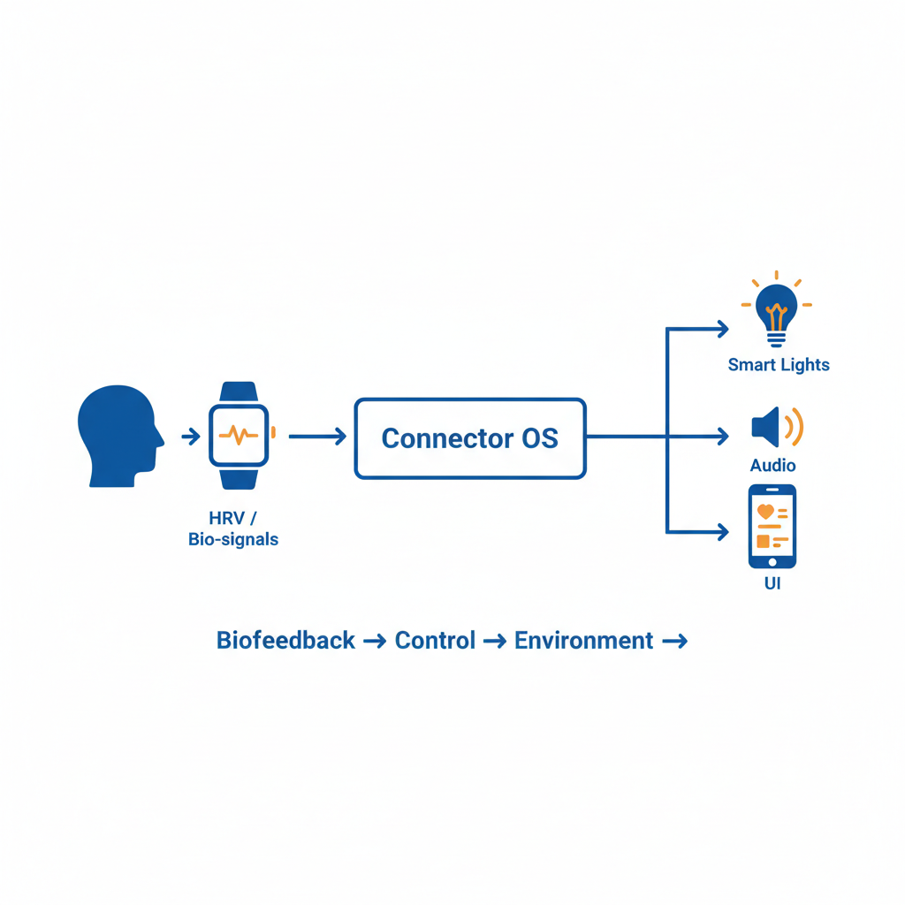

# Layered Architecture Specification v0.1


**Connector OS** is organized into an 8-layer stack.

Unlike traditional AI architectures where the model (Layer 6) is the center of the universe, Connector OS treats the model as a pluggable component. The **intelligence** resides in the coordination between layers.

---

## The Stack

| Layer | Name | Function | Analogies |
|:------|:-----|:---------|:----------|
| **7** | **Co-Thought** | Emergent joint reasoning | Jam session, Hive mind |
| **6** | **AI Models** | Pluggable intelligence engines | The Brain, CPU |
| **5** | **Human State** | Bio-affective band tracking | The Nervous System |
| **4** | **Actuators** | Output / Nudging | Muscles, Voice, Lights |
| **3** | **Control Logic** | Routing & Safety thresholds | Dams, Grids, Spillways |
| **2** | **CMP** | Context Map Protocol (Translation) | JSON, Unicode, MIDI |
| **1** | **Sensors** | Raw input streams | Eyes, Ears, Skin |
| **0** | **F₀ Resonance** | Timing & Synchronization | Heartbeat, 40Hz Carrier |

---

## Detailed Layer Specs

### Layer 0: F₀ Resonance (The Physics)

**Goal:** Align biological and digital update cycles to prevent "jitter."

- **Mechanism:** Defines the fundamental "frame rate" of the system (approx 40Hz).
- **Function:** Ensures that sensor sampling and actuator pulses happen within the window of human perceptual binding.
- **Why it matters:** Without F₀, feedback loops feel laggy or disjointed. With F₀, they feel like an extension of the body.

---

### Layer 1: Sensors (The Roots)

**Goal:** Gather raw data about user and environment.

**Inputs:**
- **Bio:** HRV, skin temp, EMG (muscle tension).
- **Behavior:** Typing cadence, mouse jitter, gaze fixations.
- **Audio/Visual:** Voice prosody, ambient noise, screen context.

**Philosophy:** "Measurement, not surveillance." Sensors are active only when needed (see *Scaffolding* in `05_calibration_and_protocols.md`).

---

### Layer 2: CMP - Context Map Protocol (The Translator)

**Goal:** Normalize raw data into a universal language.

**Problem:** GPT-4 doesn't know what "HRV = 30ms" means.

**Solution:** CMP translates raw signals into **State Glyphs**.

| Raw Signal | State Glyph |
|------------|-------------|
| HRV 30ms | `STATE_STRESS_LEVEL_3` |
| Fast typing + Silence | `STATE_FLOW_HIGH` |
| Slow typing + Sighs | `STATE_FATIGUE_RISING` |

**Benefit:** Allows swapping Layer 6 models without rewriting sensor drivers.

---

### Layer 3: Control Logic (The Dam)




**Goal:** Manage flow, load, and safety.

**The "Dam" Logic:**
- *Pressure:* Cognitive load / Ambiguity.
- *Spillway:* If Pressure > Threshold, simplify output or ask clarifying question.

**The "Grid" Logic:**
- *Load Balancing:* Route simple queries to fast models, complex queries to reasoning models.

**The "Bounce" (HQG):**
- Uses nonlinear feedback (β ψ³) to dampen runaway loops (hallucination/panic).

---

### Layer 4: Actuators (The Effectors)

**Goal:** Output to the world.

**Modes:**
- **Ambient:** Smart lights (Hue), Thermal (Embr), Audio (Spotify).
- **Haptic:** Wrist taps (Watch), Vibration (Apollo).
- **Explicit:** Text UI, Voice response, AR Overlay.

**Rule:** Nudge-first. Always try the lowest-resolution output first (e.g., light color change before voice alert).

---

### Layer 5: Human State Loop (The User)

**Goal:** Model the human as a dynamic system, not a static user.

**Bands:**

| Band | State | Description |
|------|-------|-------------|
| 🟢 Green | Calm | Baseline, relaxed |
| 🔵 Blue | Flow | Focus, productive |
| 🟡 Yellow | Load | Strain, manageable stress |
| 🔴 Red | Stress | Dysregulation, acute |
| ⚫ Grey | Depletion | Exhaustion, sleepiness |

**Action:** The OS constantly tries to steer the system toward Green or Blue.

---

### Layer 6: AI Models (The Engines)

**Goal:** Provide reasoning and generation.

**Role:** Pluggable backends.

**Examples:**
- OpenAI GPT-4
- Anthropic Claude
- xAI Grok
- Google Gemini
- Local Llama/Mistral

**Constraint:** The model is *not* allowed to override Layer 3 safety logic.

---

### Layer 7: Co-Thought (The Emergence)

**Goal:** Collaborative cognition.

**Description:** The state where the human and AI are "jamming."

**Features:**
- **Shadow State:** AI predicts user needs before explicit prompting.
- **Silent Language:** Communication via minimal signals (e.g., gaze + nod).
- **Concept Jamming:** Rapid iteration on abstract ideas.

---

## Interaction Flow Example

A complete loop through the stack:

```
1. L1 (Sensor):    Watch detects HRV drop.
2. L2 (CMP):       Translates to STATE_YELLOW (Rising Strain).
3. L3 (Logic):    Checks thresholds. Determines Action = Nudge.
4. L4 (Actuator): Dims lights to warm amber.
5. L5 (Human):    User feels environment soften, takes a breath.
6. L0 (Resonance): Loop closes within 40Hz window, feeling instant.
```

**Total latency:** < 25ms (within perceptual binding window).

**User experience:** "The room just... knew."

---

## Layer Interaction Patterns

### Bottom-Up Activation
```
L0 → L1 → L2 → L3 → L4 → L5 → L6 → L7
(Timing) (Sense) (Translate) (Route) (Act) (Track) (Think) (Jam)
```

### Top-Down Modulation
```
L7 → L6 → L5 → L4 → L3 → L2 → L1 → L0
(Intent) (Model) (State) (Output) (Safety) (Format) (Focus) (Sync)
```

### Horizontal Resonance
```
L0 ↔ L4: Timing alignment (actuators pulse on F₀ rhythm)
L1 ↔ L5: Closed biosignal loop (sense → state → sense)
L2 ↔ L6: Protocol handshake (glyphs ↔ model context)
L3 ↔ L3: Self-referential safety (control checks control)
```

---

## Design Principles Encoded in Layers

| Principle | Layer(s) | Implementation |
|-----------|----------|----------------|
| Model-agnostic | L6 | Models are plugins, not core |
| Human-in-the-loop | L5, L7 | Human state is tracked and respected |
| Local thresholds | L3, L5 | Personal baselines, not population norms |
| Nudge-first | L4 | Ambient before explicit |
| Bounded loops | L3 | Safety logic cannot be overridden |

---

## What's Next

- **Deep dive on Control Logic:** `docs/04_control_laws_and_analogies.md`
- **First implementation:** `mvm/MVM-1_vibe-check_prometheus-1.md`
- **Physics foundation:** `docs/appendix_helix_engine_v3.md`

---

*The stack is the skeleton. The MVMs are the muscles. The human is the soul.*
