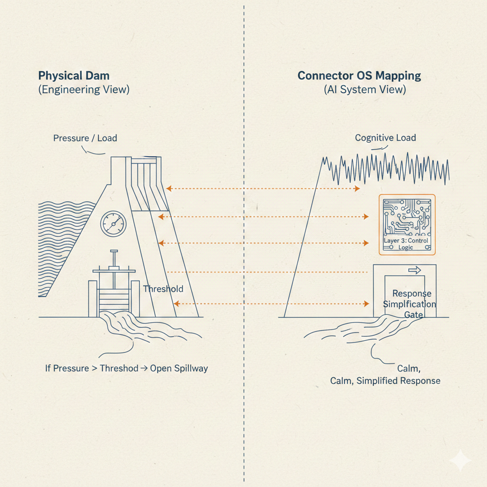
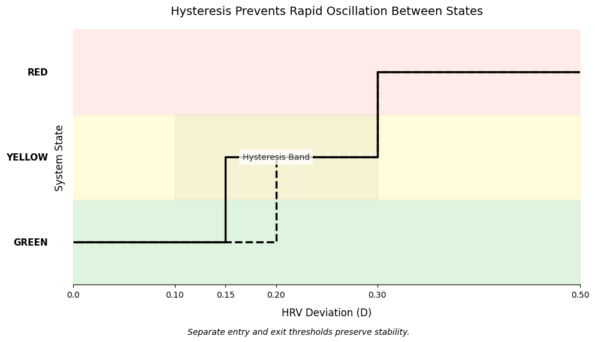

## 4. Thresholds & Controlled Release (Dam Analogy)

Before discussing adaptive reliability, it is necessary to clarify the control intuition behind Layer 3.

Connector OS does not operate on absolute values.  
It operates on **thresholds and controlled release mechanisms.**

The physical analogy is infrastructure regulation:



### Structural Mapping

| Physical Dam | Connector OS |
|--------------|--------------|
| Water Pressure | Cognitive Load / Ambiguity |
| Spillway Gate | Threshold Detector |
| Controlled Release | Response Simplification / Clarification |
| Structural Failure | Hallucination / Instability |

If pressure remains below threshold → no intervention.  
If pressure crosses threshold → controlled release activates.

This prevents rupture.

Layer 3 applies identical logic to cognitive load and model ambiguity.

The objective is not suppression.  
The objective is **stability under rising load.**

---

## 5. Dynamic Reliability (The Governor)

In production systems, safety cannot be binary (“hard rules” vs. “fully adaptive”).  
Trust must adjust dynamically based on measurable system conditions.

Connector OS implements this through a dynamic reliability parameter: **α (alpha).**

---

### 5.1 The Alpha (α) Safety Bias

We define α as a control parameter governing bias toward deterministic rule logic.

$$
\text{Output} = (\alpha A_{\text{rule}}) + ((1 - \alpha) A_{\text{learned}})
$$

Where:

- **α = 1.0** → Fully rule-governed behavior  
- **α = 0.0** → Fully learned-pattern behavior  

In practice, this may represent gating, ranking, policy selection, or confidence weighting depending on actuator type. It does not require literal numeric blending.

---

### 5.2 The Governor Function

Alpha is not estimated heuristically.  
It is determined by a **max-risk protocol**:

$$
\alpha_{target} = \max(E, L, D)
$$

Where risk factors are normalized to [0.0 – 1.0]:

1. **Entropy (E)** — Input signal uncertainty  
   - High noise → bias toward deterministic rules  

2. **Load (L)** — System pressure  
   - High queue depth or latency → bias toward cheaper deterministic behavior  

3. **Divergence (D)** — Rule–model action conflict  
   - If deterministic policy and learned action disagree in safety-critical ways → D = 1.0  

The maximum risk dominates.

This ensures worst-case conditions determine reliability posture.

---

### 5.3 Hysteresis (State Smoothing)

Rapid oscillation between reliability modes destabilizes systems.

We apply hysteresis via low-pass filtering of α:



Key principle:

- Entry and exit thresholds differ intentionally.
- State transitions are smoothed over time.

This creates stability bands and prevents mode flapping near boundaries.

---

### 5.4 Production Protocols

#### Shadow Mode (Validation Phase)

Before a learned pattern is permitted to actuate:

1. Execute learned policy in background.
2. Compare against observed user behavior.
3. Promote only when performance exceeds a configurable reliability threshold over a defined validation window.

All numeric thresholds (confidence %, duration, override tolerance) are system parameters, not constants.

---

#### Circuit Breaker (Drift Detection)

If user overrides or safety conflicts exceed a configurable tolerance:

1. Trigger circuit breaker.
2. Force α → 1.0 (deterministic mode).
3. Log drift event.
4. Require recalibration.

This ensures recovery from topology drift without catastrophic failure.

---

### 5.5 Implementation Logic (Illustrative)

```python
def calculate_alpha(input_signal, system_stats, rule_action, learned_action):
    # 1. Risk factors
    entropy = get_signal_variance(input_signal)
    load = system_stats.queue_depth / MAX_QUEUE
    
    # 2. Divergence check
    divergence = 1.0 if is_safety_conflict(rule_action, learned_action) else 0.0

    # 3. Max-risk dominance
    alpha_target = max(entropy, load, divergence)
    
    # 4. Apply smoothing
    return apply_low_pass_filter(alpha_target)
```

This function is illustrative; production systems would implement domain-specific estimators and smoothing functions.

---
### Summary

Layer 3 enforces stability through:

- Threshold-triggered release
- Max-risk reliability bias
- Hysteresis smoothing
- Shadow validation
- Circuit breaker recovery

These mechanisms mirror infrastructure regulation patterns and ensure that learned behavior never overrides safety boundaries under uncertainty.

---
