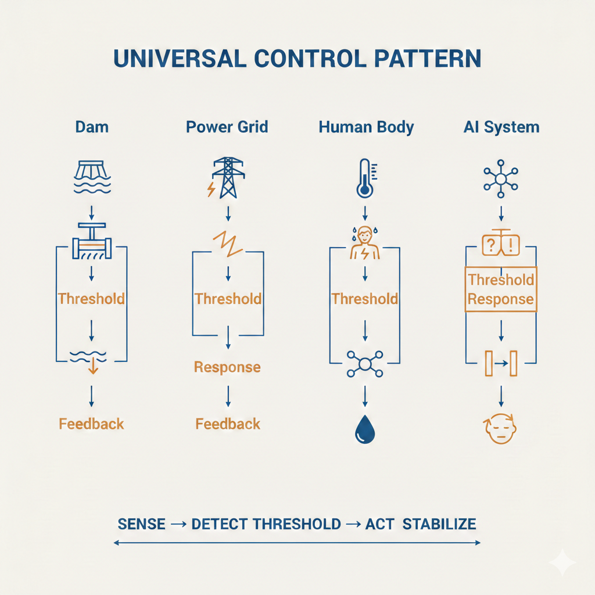

# Cross-Domain Validation of Connector Principles

One of the strongest checks on Connector OS is that its core control laws appear **across many unrelated domains**.

This file lays out those domains and what each one validates.

---

## 1. Universal pattern

Across all systems we looked at, the same pattern keeps appearing:

> Systems do not change state because of absolute values.  
> They change when **hidden thresholds** are crossed, and they stabilize via **feedback** and **rerouting**.

Connector OS encodes this as:

- Sense early micro-signals
- Detect thresholds
- Reroute or release load
- Maintain stability with minimal force

---

## 2. Domains and what they validate

### 2.1 Physical infrastructure

**Dams (hydroelectric / flood control)**  
- Validate: **Threshold detection**, **spillways**, **controlled release**  
- Mapping:
  - Water pressure → cognitive load / ambiguity
  - Spillway opening → simplifying response / asking for clarification
  - Catastrophic failure → hallucination / breakdown

**Electrical grids**  
- Validate: **Load balancing**, **step-up/step-down**, **cascading failure behavior**  
- Mapping:
  - Transformers → scaling complexity of responses
  - Rerouting power → choosing which model/tool handles which task
  - Rolling blackouts → graceful degradation instead of hard failure

---

### 2.2 Environmental dynamics

**Weather / cloudbursts**  
- Validate: **Chaos → pattern → phase transitions**, **early warning signals**  
- Mapping:
  - Subtle shifts in humidity and pressure → early micro-signals of stress or confusion
  - Cloudburst vs. normal rain → meltdown vs. manageable load
  - Forecast skill → predictive models for state transitions

**Plants & growth patterns**  
- Validate: **Plasticity**, **sensitivity to micro-environment**, **path dependence**  
- Mapping:
  - Same seed, different outcomes → same model, different user contexts
  - Root search → sensor exploration
  - Pruning and branching → specialization of connectors over time

---

### 2.3 Biological & cognitive systems

**Brain scans / neuroplasticity**  
- Validate: **Scaffolding**, **pathway rerouting**, **relative baselines**  
- Mapping:
  - Learning as rewiring → connector tuning over time
  - Child vs adult brain → early dense sensing vs later sparse prediction
  - Hemispheric specialization → multi-agent division of labor

**Grip pressure / micro-motor signals**  
- Validate: **Subconscious state leakage**, **low-bandwidth but high-signal channels**  
- Mapping:
  - Stronger phone grip when anxious → candidate signal for stress inference
  - Tiny changes in interaction style → useful for state estimation with minimal sensing

**Multilingual brains / code-switching**  
- Validate: **Multi-stable representations**, **context-dependent routing**  
- Mapping:
  - Same concept in multiple languages → same intent across modalities
  - Seamless switching → dynamic routing between models/tools

---

### 2.4 Information & creative systems

**Music**  
- Validate: **State transitions via waveforms**, **tension–release control**, **resonant frequencies (e.g., 40 Hz)**  
- Mapping:
  - Rhythm → sampling cadence / carrier wave
  - Harmony vs dissonance → cognitive ease vs strain
  - Crescendo → controlled ramp-up of cognitive load
  - 40 Hz bands → F₀ resonance layer

**Art interpretation (duck–rabbit, ambiguous images)**  
- Validate: **Multi-stable percepts**, **parallel hypotheses**, **context-driven collapse**  
- Mapping:
  - "Both are true until we decide" → Connector OS holds multiple interpretations until context disambiguates
  - Avoid premature collapse → better than single-shot answers

**Chemical reactions**  
- Validate: **Emergence from interaction**, **non-linearity**, **catalysis**  
- Mapping:
  - A + B ≠ A + B, but C with new properties → combined signals (voice + gaze + HRV) creating richer state than any one alone
  - Catalysts → specific sensors or hints that drastically speed up understanding

---

### 2.5 Communication & networks

**Wireless protocols / 6G & beyond**  
- Validate: **Carrier frequency bands**, **latency constraints**, **multi-channel multiplexing**  
- Mapping:
  - Shared timing window → F₀ layer (~40 Hz as biological–digital handshake)
  - Bandwidth allocation → picking which connectors to use when
  - Superhuman bandwidth → reason for building the OS beyond human limits

---

## 3. Summary

Each of these domains independently supports the same **control laws**:

- Sense early and gently  
- Treat thresholds, not absolutes  
- Reroute instead of brute-forcing  
- Maintain inertia where useful (hysteresis)  
- Use non-linear feedback to avoid both collapse and explosion  

Connector OS doesn't "invent" these laws.  
It **borrows them from the universe**, then encodes them as:

- Layer-3 control logic  
- MVM behaviors  
- Calibration & safety protocols

For a deeper dive into the physics mapping, see:

- `docs/04_control_laws_and_analogies.md`  
- `docs/appendix_helix_engine_v3.md`
